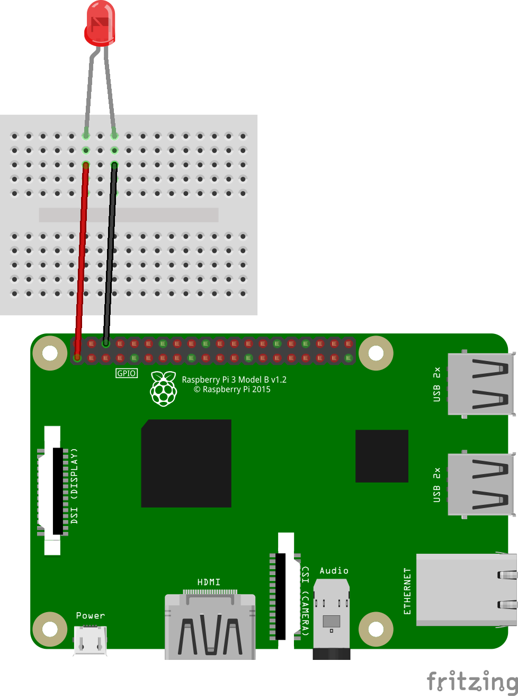
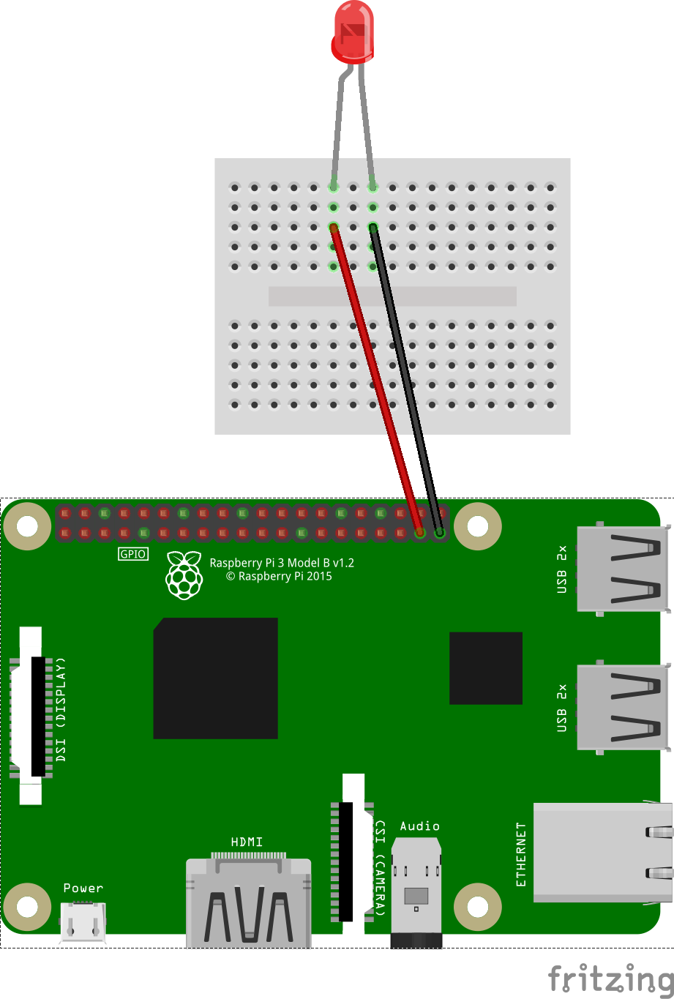

# Cum conectăm un LED la Raspberry Pi

## Direct

## Programabil

1. [1_led.py](1_led.py) pentru a porni LED-ul
2. [2_led.py](2_led.py) pentru o secvență pornit/oprit
3. [3_led.py](3_led.py) pentru o secvență pornit/oprit în buclă

## Exercițiu
Conectați mai multe LED-uri și programați-le separat
