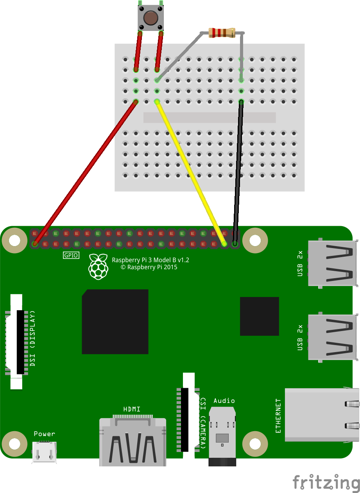

# Cum conectăm un buton la Raspberry Pi

Butoanele de tip push, de obicei au 4 pini, legați 2 câte 2. La apăsarea butonului, cele 2 perechi de pini vor fi conectate între ele.

## Pull up / down
În cazul microcontrollerelor și a plăcilor de dezvoltare digitale, orice voltaj de intrare apropiat de GND va fi citit ca 0, iar un voltaj apropiat de VCC va fi citit ca 1. Fiindcă diferența de voltaj dintre cele două este destul de mică, orice fluctuație provenită din exterior (de exemplu radiofrecvență) poate să schimbe valoarea digitală citită.

Pentru ca circuitele noastre să fie cât mai solide, pe pinii de intrare este recomandat să folosim rezistențe pull up sau pull down, care, în lipsa altui semnal mai puternic, leagă pinul de intrare la GND sau VCC pentru a fi siguri că avem o citire exactă.

1. [1_button.py](1_buton.py) exemplu de citire a valorii butonului

## Exerciții
1. Conectați un buton și un LED. La apăsarea butonului LED-ul trebuie să se aprindă. Când butonul revine, LED-ul trebuie să se stingă.
2. Conectați un buton și un LED. La apăsarea butonului LED-ul trebuie să se aprindă dacă era stins, sau să se stingă dacă era aprins. Când butonul revine, nu trebuie să se întâmple nimic.