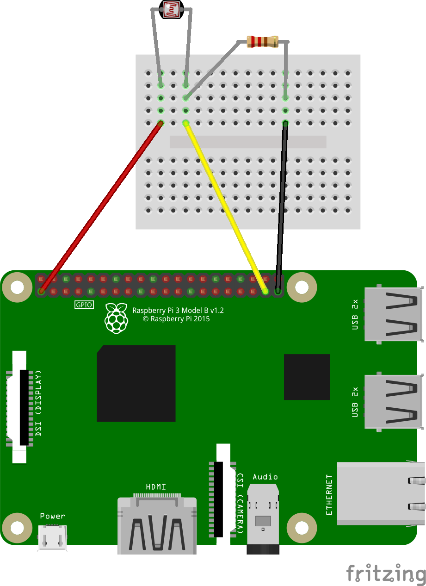

# Cum conectăm un fotorezistor la Raspberry Pi
Fotorezistorul este un element de circuit căruia îi variază rezistența în funcție de intensitatea luminii care ajunge la el.

Folosind un circuit asemănător cu cel de la buton, putem citi voltajul care ajunge în Raspberry Pi. Acest voltaj va fi proporțional cu intensitatea luminii.

Raspberry Pi, din păcate, nu are intrări analogice. Astfel, vom putea citi doar dacă pe fotorezistor ajunge multă lumină (1), sau foarte puțină lumină (0).

1. [1_photocell.py](1_photocell.py) - exemplu de citire a valorii fotorezistorului
2. [2_photocell.py](2_photocell.py) - măsurarea vitezei unui obiect cu ajutorul unui fotorezistor
