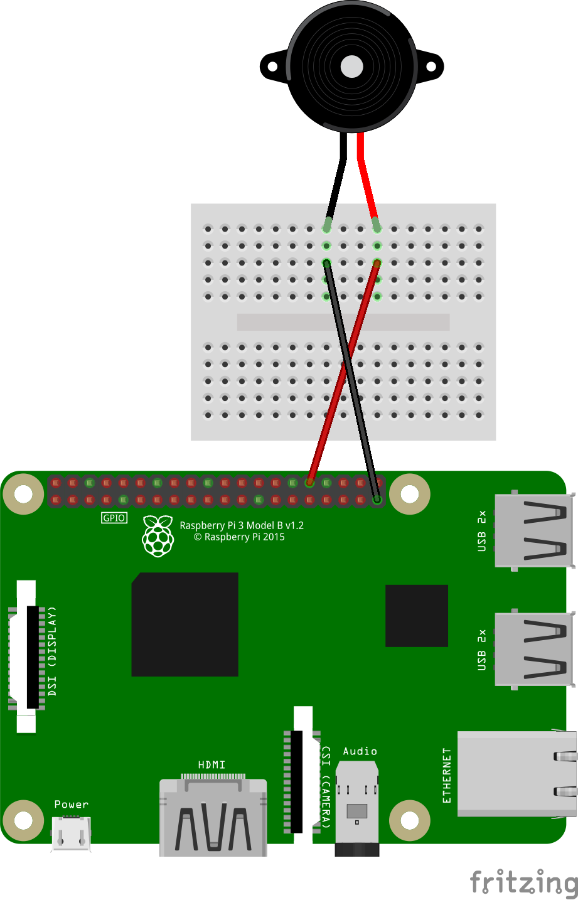

# Cum conectăm un difuzor piezoelectric la Raspberry Pi

Un difuzor piezoelectric folosește un voltaj variabil pentru a genera sunete. Modificările de voltaj schimbă forma materialului difuzorului, iar repetând acest proces, putem controla frecvența sunetului produs.

## Pulse-width modulation (PWM)

Raspberry Pi, după cum am discutat în secțiunile precedente, are doar pini digitali. Așadar, nu putem varia voltajul de ieșire din acești pini, doar ~3.3V (1) sau ~0V (0).

Putem, în schimb folosi PWM pentru a simula aceste schimbări de voltaj. Cu PWM, putem să variem timpul în care aplicăm voltajul maxim pentru ca materialul difuzorului să își schimbe forma treptat, puțin câte puțin.

Mai multe informații despre PWM puteți găsi aici: [https://en.wikipedia.org/wiki/Pulse-width_modulation](https://en.wikipedia.org/wiki/Pulse-width_modulation)

Raspberry Pi are câțiva pini pe care se poate folosi PWM, iar la unul din acest vom conecta și noi difuzorul.

1. [1_buzzer.py](1_buzzer.py) - exemplu cu 2 frecvențe
2. [2_buzzer.py](2_buzzer.py) - o melodie întreagă